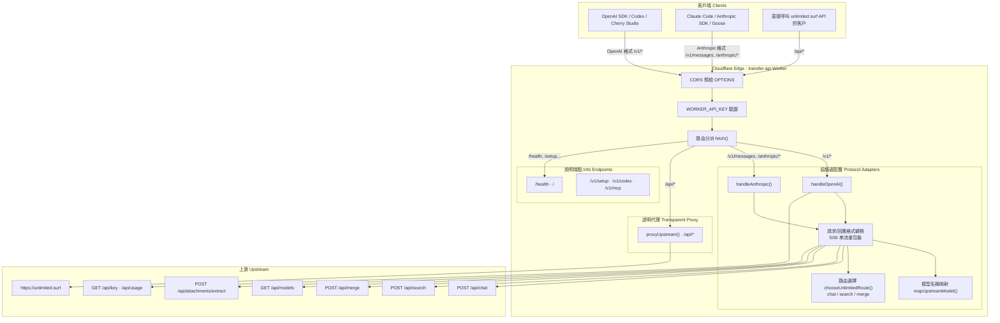

# 架構地圖 · Architecture Map

> 掃描時間：2026-06-22  
> 專案：`transfer-api`（Cloudflare Worker）

## ELI5 類比

想像這是一個「**多語言翻譯櫃台**」，不是單純把包裹原封不動轉寄。

- 客人 A 說 **OpenAI 語**（`/v1/chat/completions`）→ 櫃台翻成 **unlimited.surf 語**（`/api/chat`）再寄出，回覆也翻回 OpenAI 格式。
- 客人 B 說 **Anthropic/Claude 語**（`/v1/messages`）→ 同樣翻譯往返。
- 若客人直接說 **unlimited.surf 原語**（`/api/*`）→ 才幾乎是「原封轉寄」。
- 櫃台還會幫你藏 **上游 API Key**（`UNLIMITED_SURF_API_KEY`），客人只需出示自己的 **Worker Key**（`WORKER_API_KEY`）。

所以：**不只是中轉站，更是協議適配器（Adapter）+ 部分透明代理（Proxy）。**

---

## 系統拓撲（Mermaid）

---

## 路由分類一覽

| 類型 | 路徑範例 | 行為 |
|------|----------|------|
| **純代理** | `/api/chat`, `/api/search`, `/api/models`… | 幾乎原樣轉發，替換 Authorization |
| **OpenAI 適配** | `/v1/chat/completions`, `/v1/responses`, `/v1/models` | 請求轉換 → 上游 → 回應重包裝 |
| **Anthropic 適配** | `/v1/messages`, `/anthropic/v1/messages` | 同上，Anthropic SSE 格式 |
| **能力直達** | `/v1/search`, `/v1/merge` | 映射到 `/api/search`, `/api/merge` |
| **說明/設定** | `/v1/setup`, `/v1/codex`, `/v1/mcp` | 回傳靜態文字/JSON，不呼叫上游 |
| **刻意不支援** | `/v1/embeddings`, `/v1/audio/*`, `/v1/images/*` | 回傳 501 |

---

## 核心檔案

| 檔案 | 職責 |
|------|------|
| `src/worker.js` | 全部邏輯（~1160 行，單檔 monolith） |
| `wrangler.toml` | Cloudflare Worker 部署設定、環境變數 |
| `package.json` | 僅 wrangler 開發依賴 |
