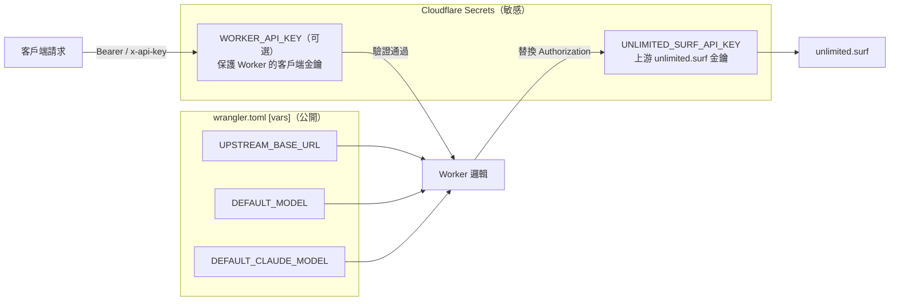

# 依賴與狀態分析 · Dependency & State Analysis

> 掃描時間：2026-06-22

## ELI5 類比

這個專案像一台「**極簡自動販賣機**」：
- 裡面幾乎沒有複雜零件（沒有 React、沒有資料庫套件）。
- 唯一需要的「外部零件」是 Cloudflare 的 Wrangler 工具，用來把程式部署到邊緣節點。
- 機器本身**不存任何資料**（無 KV、無 R2、無 D1），每次請求都是即時處理、即時轉發。

---

## 執行環境

| 項目 | 值 |
|------|-----|
| 平台 | Cloudflare Workers（Edge Runtime） |
| 入口 | `src/worker.js` → `export default { fetch }` |
| 模組系統 | ES Module (`"type": "module"`) |
| 相容日期 | `2025-11-21`（wrangler.toml） |

---

## npm 依賴

```json
{
  "devDependencies": {
    "wrangler": "^4.0.0"
  }
}
```

- **零 runtime 依賴**：生產環境不打包任何第三方 npm 套件。
- 全部邏輯使用 Workers 內建 API：`fetch`, `crypto.getRandomValues`, `TextEncoder/Decoder`, `ReadableStream`。

---

## 環境變數 / Secrets 狀態流



### Key 邏輯摘要

| 設定狀態 | 客戶端行為 | 上游請求使用 |
|----------|------------|--------------|
| 有 `WORKER_API_KEY` + 有 `UNLIMITED_SURF_API_KEY` | 必須傳 `WORKER_API_KEY` | `UNLIMITED_SURF_API_KEY` |
| 無 `WORKER_API_KEY` + 有 `UNLIMITED_SURF_API_KEY` | 任意 key 皆可 | `UNLIMITED_SURF_API_KEY` |
| 無 `WORKER_API_KEY` + 無 `UNLIMITED_SURF_API_KEY` | 客戶端 key 直接當上游 key | 客戶端傳入的 key |

---

## 狀態管理

| 狀態類型 | 是否存在 | 說明 |
|----------|----------|------|
| 持久化儲存 | ❌ 無 | 無 KV / R2 / D1 綁定 |
| Session | ❌ 無 | 完全無狀態（stateless） |
| 檔案快取 | ❌ 無 | `/v1/files` GET 回傳空列表；單檔 GET 回 404 |
| 模型列表快取 | ❌ 無 | 每次 `/v1/models` 都即時請求上游，失敗才用 fallback |

---

## 上游 API 對應

| Worker 端點 | unlimited.surf 端點 | 轉換程度 |
|-------------|----------------------|----------|
| `/api/*` | 同路徑 | 無（純代理） |
| `/v1/chat/completions` | `/api/chat`（或 search/merge） | 高 |
| `/v1/responses` | `/api/chat`（或 search/merge） | 高 |
| `/v1/messages` | `/api/chat`（或 search/merge） | 高 |
| `/v1/search` | `/api/search` | 中 |
| `/v1/merge` | `/api/merge` | 中 |
| `/v1/models` | `/api/models` + fallback | 中 |
| `/v1/files` POST | `/api/attachments/extract` | 中 |
| `/v1/key`, `/v1/usage` | `/api/key`, `/api/usage` | 低（代理） |

---

## 部署流程

1. `npm install` → 安裝 wrangler
2. `wrangler secret put UNLIMITED_SURF_API_KEY` → 設定上游 key
3. `wrangler deploy` → 部署到 `*.workers.dev`
4. 可選：GitHub → Cloudflare 自動 CI/CD
